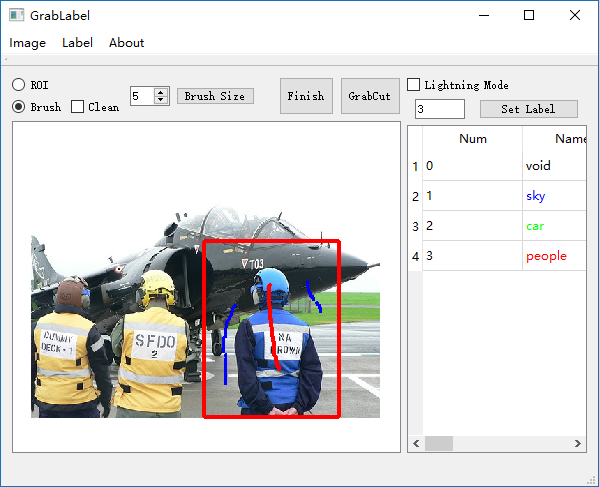
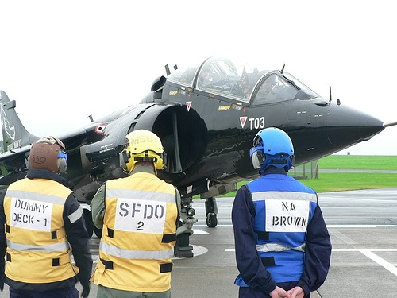
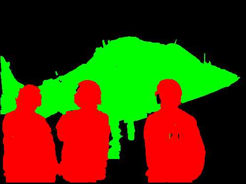
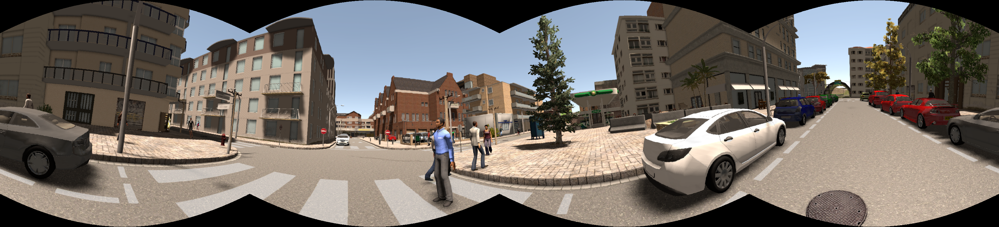
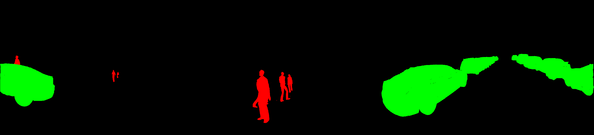

# GrabLabel

An interactive application for segmentation labeling.

## Basic Description

This application has an interactive GUI and uses grabcut algorithm. You can use it to label images as training data for deep learning tasks, such as semantic segmentation. If you only want to use this application, the files in "bin" are what you need.

## Developing Tool

Visual Studio 2017 with Qt Extension

## Dependency Libs/Tools

Qt 5.9.1, OpenCV 3.4.5

## GUI

## Instructions

* Preparing: First thing before you start to use it, make a txt file of your label information. The format is "value name R G B" for each line, for example "3 sky 0 0 255". The value is the exact value in the final result gray image. The name doesn't affect anything, just for convenience. R G B is the color that will appear in the final result color image.

* Grabcut: Once you finish creating the txt file, you can start labeling. Load an image and load your txt file. Then input one value and click set label button. Next, draw a ROI which contains the object you want to label. Then you can use the brush to mark the foreground with left mouse button and the background with the right mouse button. After click GrabCut button, you will soon see the result.

* Interacting: If you are not contented with the result, you can still use brush to mark or clean the mark, and then grabcut
again and again. Once you think the result is OK, click Finish button, and the result will be saved temporarily (not as the final result).

* Finish: After clicking Finish button, you should set a label again to begin next cut session even the label value is the same. In each
session, you should focus on one object or a sequences of adjacent objects.

* Saving: If you have labeled all the objects you want then you can save your final result as a file. The final result image consists of all the label images you created with the Finish button. As for the order, you should first label the objects near to you because they will be put on the upper layers in the final result image. There are two format of the output label image, the gray version and the color version. The gray version has pixel values you set in the txt file, with 1 channel. The color version has RGB values you set in the txt file, with 3 channels.

* Restarting: After you have labeled one image and saved the result, you should close the image before you open a new one.

# Some Caveats

* Before grabcut, make sure a label has been set and a ROI has been draw.
* Brush size will be adjusted only after you click Brush Size button.
* Use left mouse button to mark foreground which has red color and right button to mark background which has blue color.
* Use Clean Box to clean the mark you have draw, both left and right mouse button are available.
* Lightning mode is recommended to be used to accelarate grabcut when the size of the image is quite large. In this mode, the ROI will be treated as the whole cut region so that the time consumption of grabcut is reduced greatly but the result, as trade-off,  may not be as satisfying as in normal mode.

# Examples

